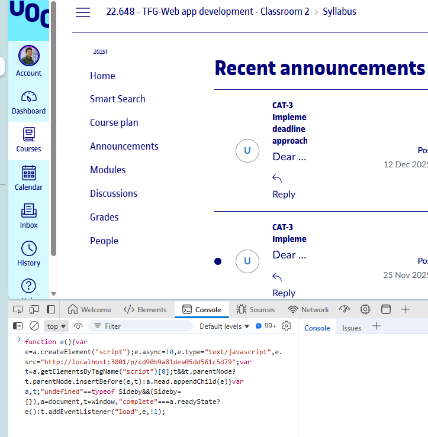
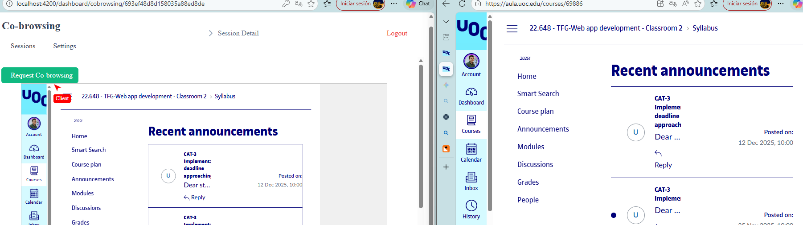

# SIDEBY: Co-browsing Tool

This project is a co-browsing tool that allows agents to view and interact with a user's browser session in real-time. It consists of a Node.js backend (`nectar`) and an Angular frontend (`tgf-jorge-cobrowsing`).

## Prerequisites
*   **DOCKER**.
* Launch compose with jetbrains IDE or docker desktop if not just docker-compose up --build
* When build done, angular is located in "http://localhost:4200/"

or
*   **Node.js:** Version 20 or higher is recommended.
*   **Angular CLI:** Install globally using `npm install -g @angular/cli`.

### Default account for testing
User: admin@example.com
Password: password123

## Project Structure

*   `/nectar`: Our main data management place with a Node.js API and WebSocket server.
*   `/tgf-jorge-cobrowsing`: Angular frontend dashboard for agents.

## Setup & Running(No docker way)

### 1. Backend (Nectar)

1.  Navigate to the `nectar` directory:
    ```bash
    cd nectar
    ```

2.  Install dependencies:
    ```bash
    npm install
    ```

3.  **Configuration:**
    *   Check `nectar/config/index.json` and ensure the `DATABASE.URL` points to your MongoDB instance.
    *   Ensure `API_BASE_URL` matches your local server address (e.g., `http://localhost:3001`).

4.  **Database Seeding (Not necessary for teacher mongo is cloud based so is already filled):**
    *   This script creates a default admin entity and user, and ensures the entity has a valid `code` for script generation.
    ```bash
    node seed.js
    ```
    *   **Important:** Copy the **Entity Code** outputted by this script. You will need it to test the client script.

5.  **Build the Client Script:**
    *   This generates the `lib.js` file that client websites will load.
    ```bash
    node scripts/libraries/cobrowsing/build-cobrowsing-lib.js
    ```

6.  Start the server:
    ```bash
    npm start
    ```
    The server should be running on port 3001 (or as configured).

### 2. Frontend (Angular Dashboard)

1.  Navigate to the frontend directory:
    ```bash
    cd tgf-jorge-cobrowsing
    ```

2.  Install dependencies:
    ```bash
    npm install
    ```

3.  Start the development server:
    ```bash
    ng serve
    ```
    The dashboard will be available at `http://localhost:4200`.

### 3. Testing the Client Script
There are two ways, using your own website with script embedded or just go to any site and paste this script on console:

Easy way for testing purposes we need to insert in console TWO TIMES the script due to non controlled init by doing this way:
```js
function e(){var e=a.createElement("script");e.async=!0,e.type="text/javascript",e.src="http://localhost:3001/p/cd90b9a81dea05dd561c5d79";var t=a.getElementsByTagName("script")[0];t&&t.parentNode?t.parentNode.insertBefore(e,t):a.head.appendChild(e)}var a,t;"undefined"==typeof Sideby&&(Sideby={}),a=document,t=window,"complete"===a.readyState?e():t.addEventListener("load",e,!1);
```
Go to console and paste the code 2 times:

and with the front open in split screen you can do a test:


Fast video tutorial:


Another option:

To simulate a client website:

1.  Create a simple HTML file (e.g., `test-client.html`) anywhere on your computer.
2.  Add the following script tag to the `<body>`, replacing `YOUR_ENTITY_CODE` with the code you copied from the seeding step:
    ```html
    <script src="http://localhost:3001/p/YOUR_ENTITY_CODE"></script>
    ```
3.  Open this HTML file in a browser.
4.  Open the Angular dashboard (`http://localhost:4200`), log in (default: `admin@example.com` / `password123`), and go to the "Sessions" tab.
5.  You should see a new session appear. Click "Connect" to start co-browsing.

## Troubleshooting

*   **No sessions appear:**
    *   Check the browser console on the client page for errors (404 on script load, CORS issues).
    *   Check the `nectar` server console for logs indicating a connection (`[lib.bll] Received request...`).
    *   Ensure the `entityId` in the database matches the one the script is trying to use.
*   **Cursor not moving:**
    *   Ensure the `CobrowsingComponent` is receiving `client-event` messages via the WebSocket.
    *   Check that the iframe is loading correctly.

## License

